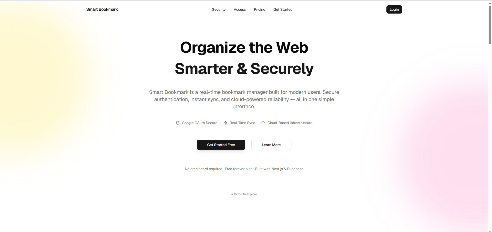
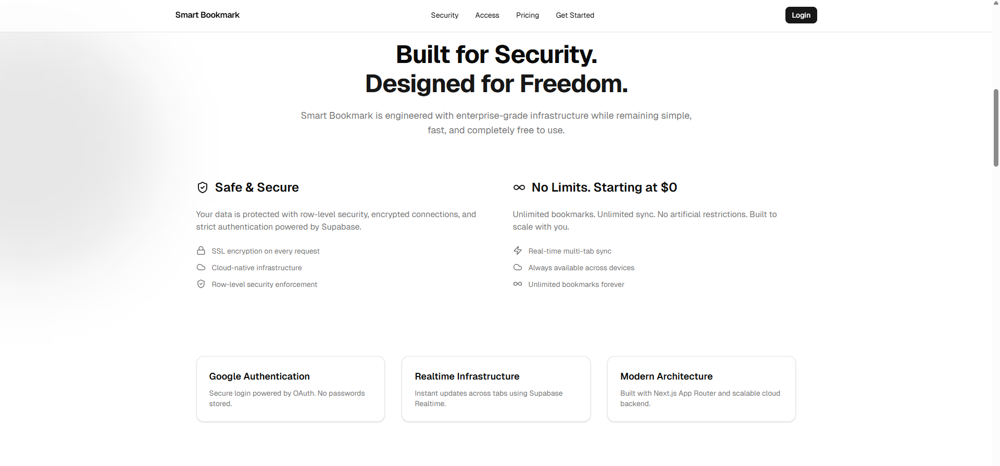
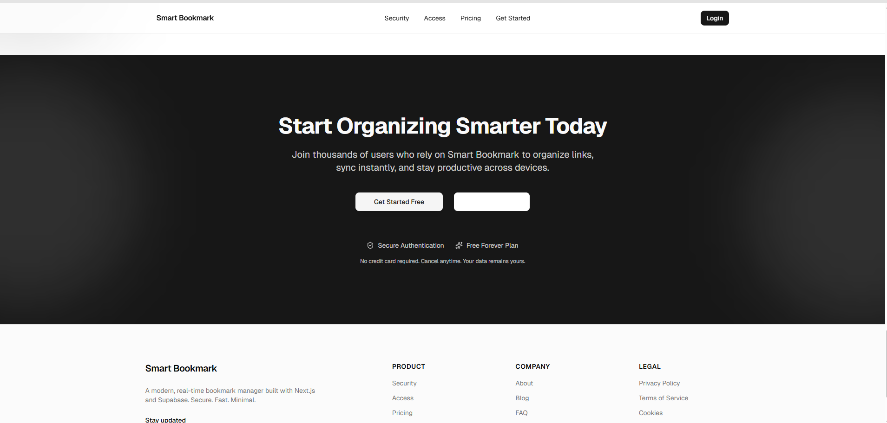
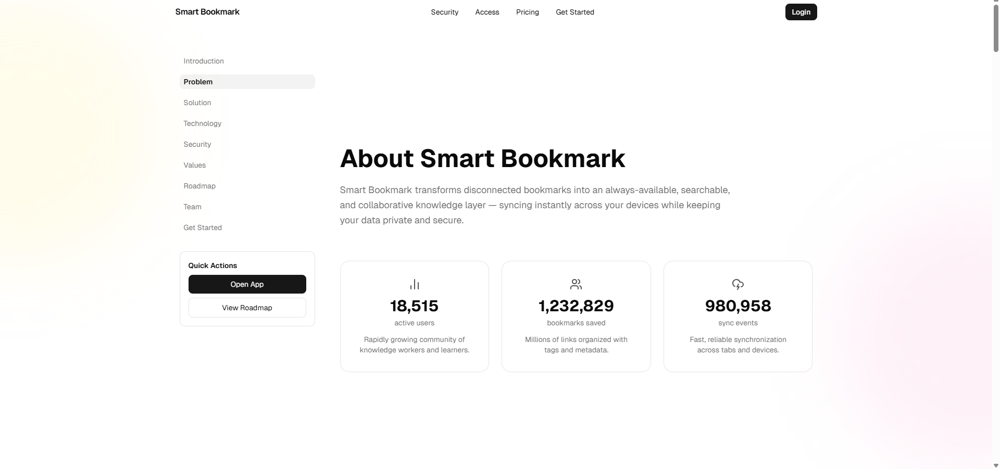

# 🚀 Smart Bookmark – Fullstack SaaS Platform

Smart Bookmark is a **production-grade, SaaS-style bookmark management platform** built with modern full-stack architecture.

This monorepo contains:

- 🧑‍💻 **Client Application** – End-user bookmark dashboard
- 🛡️ **Admin Application** – Master admin control panel
- ☁️ Supabase backend (Auth + Database + Realtime)

Designed with scalability, security, and enterprise-level architecture in mind.

---
## 📸 Gallery

### Hero


### Security


### CTA


### About


# 🌍 Live Architecture Overview

Smart Bookmark follows a **multi-application SaaS architecture**:

```
                      ┌──────────────────────────┐
                      │        Supabase          │
                      │  Postgres + Auth + RLS   │
                      └─────────────┬────────────┘
                                    │
     ┌──────────────────────────────┼──────────────────────────────┐
     │                              │                              │
     │                              │                              │
┌───────────────────┐     ┌───────────────────┐           ┌───────────────────┐
│   Client App      │     │    Admin App      │           │    API Routes     │
│  (Next.js 16)     │     │  (Next.js 16)     │           │  (Server-side)    │
│                   │     │                   │           │                   │
│ - Bookmark CRUD   │     │ - User Management │           │ - Analytics       │
│ - Realtime Sync   │     │ - Dashboard Stats │           │ - Secure Queries  │
│ - Google OAuth    │     │ - Contact Mgmt    │           │ - Role Control    │
│ - Analytics       │     │ - System Insights │           │                   │
└───────────────────┘     └───────────────────┘           └───────────────────┘
```

---

# 📂 Monorepo Structure

```
Bookmark-fullstack-app/
│
├── client-app/        → End-user SaaS dashboard
├── admin-app/         → Master admin control panel
│
├── README.md          → (You are here)
└── package.json       (optional root config)
```

---

# 🧑‍💻 Applications

---

## 🔖 1. Client Application

The Client App allows users to:

- Save, edit, delete bookmarks
- View analytics
- Experience real-time updates
- Authenticate via Google OAuth
- Use a fully responsive dashboard

### 🔗 Client App Documentation

👉 [Client App README](./client-app/README.md)

---

## 🛡️ 2. Admin Application

The Admin App provides:

- Master admin authentication
- User management
- Analytics dashboard
- Contact message monitoring
- Role-based access control
- Secure server-side APIs

### 🔗 Admin App Documentation

👉 [Admin App README](./admin-app/README.md)

---

# 🏗️ Full System Architecture

## 🧩 Technology Stack

| Layer | Technology |
|------|------------|
| Frontend | Next.js 16 (App Router) |
| Language | TypeScript |
| Styling | Tailwind CSS |
| UI Library | ShadCN UI |
| Backend | Supabase |
| Database | PostgreSQL |
| Auth | Supabase Auth + OAuth |
| Security | RLS Policies |
| Deployment | Vercel |

---

# 🔐 Security Architecture

Smart Bookmark is built with strong SaaS-grade security:

- Row-Level Security (RLS)
- Secure Supabase policies
- Role-based access control
- Protected server routes
- Secure environment variables
- Admin JWT session management
- Brute-force login protection (Admin App)

---

# 🔄 Data Flow Diagram

```
User → Client App → Supabase Auth
              ↓
    Postgres (RLS enforced)
              ↓
    Real-time subscription
              ↓
    UI auto-update (React state)
```

Admin flow:

```
Admin → Admin App → Secure API Route → Supabase Service Role
                                              ↓
                                          Database
```

---

# ⚙️ Development Setup

Clone repository:

```bash
git clone https://github.com/sankha1545/Bookmark-fullstack-app.git
cd Bookmark-fullstack-app
```

## 🖥️ Running Client App

```bash
cd client-app
npm install
npm run dev
```

Runs on:

```
http://localhost:3000
```

## 🛡️ Running Admin App

```bash
cd admin-app
npm install
npm run dev
```

Runs on:

```
http://localhost:3001 (or configured port)
```

---

# 🌎 Deployment Strategy

Both apps are deployed separately on Vercel:

- **Client** → client-bookmark.vercel.app
- **Admin** → admin-bookmark.vercel.app

Each project has isolated environment variables.

---

# 🎯 Design Philosophy

This platform is built with:

- Modular folder architecture
- Clean separation of concerns
- Enterprise-ready security
- SaaS-grade UI/UX
- Scalable backend design
- Production-level coding standards

**This is not a tutorial project — it is structured like a real startup SaaS.**

---

# 📈 Future Roadmap

- AI-powered bookmark tagging
- Folder & team collaboration
- Bookmark sharing
- Admin audit logs
- Advanced analytics dashboard
- System health monitoring

---

# 👨‍💻 Author

**Sankha Subhra Das**  
Full Stack Developer  
Next.js • Supabase • TypeScript • SaaS Architecture

**Portfolio** : https://www.sankhasubhradasportfolio.in/
---

# 📜 License

This project is built for portfolio and educational demonstration purposes.