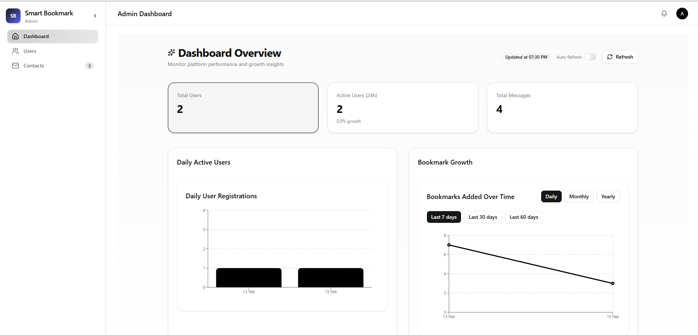
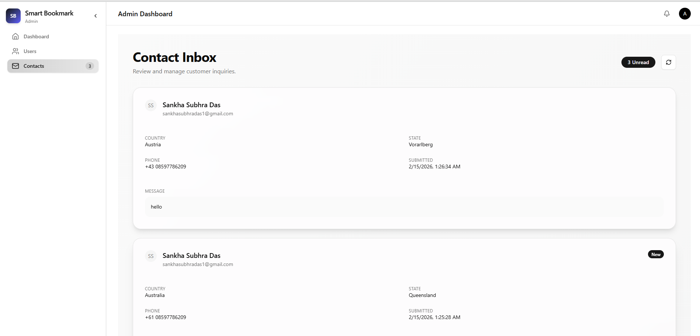
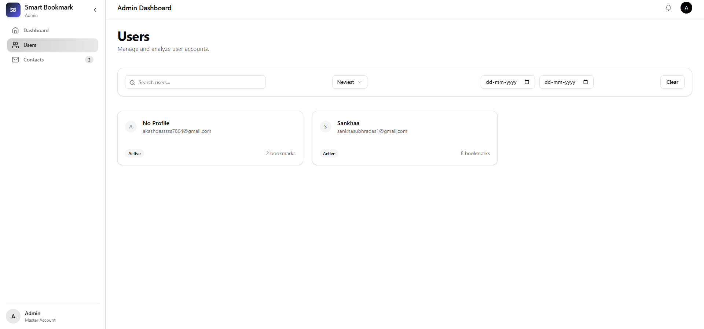

 # 🚀 Smart Bookmark — Admin Portal

[Live Demo](https://bookmark-fullstack-app-black.vercel.app/login)

A secure, production-grade Admin Dashboard for the **Smart Bookmark SaaS Platform**.

This application enables master administrators to monitor platform activity, manage users, view analytics, and oversee system-level operations.

Built with modern full-stack technologies and enterprise security best practices.

---

# 📌 Table of Contents

- Overview
- Tech Stack
- Features
- Architecture Overview
- Directory Structure
- Environment Variables
- Local Development Setup
- Deployment (Vercel)
- Security Implementation
- Analytics System
- Future Improvements
- License

---

# 🌍 Overview

The **Admin App** is the control center of the Smart Bookmark platform.

It allows administrators to:

- Monitor total users and activity
- View daily growth analytics
- Track bookmark trends
- Manage contact messages
- Maintain platform-level oversight

This app is separate from the client portal and follows a **clean SaaS architecture** with server-side rendering and strict role-based access control.

---

# 🛠 Tech Stack

| Layer | Technology |
|--------|------------|
| Framework | Next.js 16 (App Router) |
| Language | TypeScript |
| Styling | Tailwind CSS |
| UI Components | ShadCN UI |
| Animations | Framer Motion |
| Icons | Lucide React |
| Backend | Supabase (Postgres + Auth) |
| Charts | Custom Analytics Components |
| Deployment | Vercel |

---
## 📸 Gallery

### DAshboard View


### Contact View


## Users View


## Users Client View


# ✨ Features

## 🔐 Secure Admin Authentication
- Supabase Admin API integration
- Service Role key (server-only)
- Protected routes using middleware (proxy in Next.js 16)

## 📊 Analytics Dashboard
- Total Users
- Active Users (24h)
- Total Contact Messages
- Daily User Registration Chart
- Bookmark Growth Chart
- Auto Refresh Support

## ⚡ Performance Optimizations
- Server-Side Data Fetching
- ISR (Incremental Static Regeneration)
- Data Normalization Layer
- Lightweight client hydration

## 🎨 Professional UI/UX
- Modern SaaS layout
- Responsive across devices
- Dark mode compatible
- Smooth animations

---

# 🏗 Architecture Overview

The Admin App follows a layered architecture:

```
Database (Supabase)
↓
Analytics Layer (lib/analytics.ts)
↓
Server Page (app/dashboard/page.tsx)
↓
Client Dashboard Component
↓
Reusable Chart & UI Components
```

### Why this structure?

- Keeps database logic separate from UI
- Ensures consistent data shape
- Improves scalability
- Makes the system easier to maintain

---

# 📂 Directory Structure

```
admin-app/
│
├── __mocks__/
│
├── supabase.ts
│
├── .next/
├── .swc/
│
├── lib/
│   ├── utils.ts
│
├── node_modules/
├── public/
│
├── scripts/
│
├── create-admin.ts
│
├── src/
│   │
│   ├── __tests__/
│   │   ├── AdminShell.test.tsx
│   │   ├── ContactCard.test.tsx
│   │   ├── ContactsPage.test.tsx
│   │   ├── Sidebar.test.tsx
│   │   ├── UserProfileClient.test.tsx
│   │   ├── UsersClient.test.tsx
│   │   ├── UsersFilters.test.tsx
│   │
│   ├── app/
│   │   ├── (auth)/
│   │   │   └── login/
│   │   │       └── page.tsx
│   │   │
│   │   ├── (protected)/
│   │   │   ├── contacts/
│   │   │   │   └── page.tsx
│   │   │   │
│   │   │   ├── dashboard/
│   │   │   │   ├── layout.tsx
│   │   │   │   └── page.tsx
│   │   │   │
│   │   │   ├── users/
│   │   │   │   ├── [id]/
│   │   │   │   │   ├── BookmarkFilters.tsx
│   │   │   │   │   ├── BookmarkModal.tsx
│   │   │   │   │   ├── page.tsx
│   │   │   │   │   └── UserProfileClient.tsx
│   │   │   │   │
│   │   │   │   ├── page.tsx
│   │   │   │   ├── UsersClient.tsx
│   │   │   │   ├── UsersFilters.tsx
│   │   │   │   └── UsersPagination.tsx
│   │   │   │
│   │   │   └── layout.tsx
│   │   │
│   │   ├── api/
│   │   │   └── (invisible in screenshot but folder present)
│   │   │
│   │   ├── favicon.ico
│   │   ├── globals.css
│   │   ├── layout.tsx
│   │   └── page.tsx
│   │
│   ├── components/
│   │   ├── analytics/
│   │   │   ├── BookmarkLineChart.tsx
│   │   │   ├── DailyUsersBarChart.tsx
│   │   │   ├── MessagesBarChart.tsx
│   │   │   └── StatsCard.tsx
│   │   │
│   │   ├── contacts/
│   │   │   ├── ContactCard.tsx
│   │   │   ├── ContactHeader.tsx
│   │   │   ├── EmptyState.tsx
│   │   │   └── LoadingState.tsx
│   │   │
│   │   ├── dashboard/
│   │   │   ├── DashboardClient.tsx
│   │   │
│   │   ├── layout/
│   │   │   ├── AdminShell.tsx
│   │   │   ├── Sidebar.tsx
│   │   │   └── Topbar.tsx
│   │   │
│   │   ├── ui/
│   │   │   ├── avatar.tsx
│   │   │   ├── badge.tsx
│   │   │   ├── button.tsx
│   │   │   ├── card.tsx
│   │   │   ├── dialog.tsx
│   │   │   ├── input.tsx
│   │   │   ├── label.tsx
│   │   │   ├── select.tsx
│   │   │   ├── separator.tsx
│   │   │   └── switch.tsx
│   │   │
│   │   ├── users/
│   │   │   ├── DeleteUserModal.tsx
│   │   │   ├── UserCard.tsx
│   │   │   └── UserTable.tsx
│   │
│   ├── hooks/
│   │   └── useAdmin.ts
│   │
│   ├── lib/
│   │   ├── auth/
│   │   ├── supabase/
│   │   ├── analytics.ts
│   │   ├── date.ts
│   │   ├── utils.ts
│   │
│   ├── types/
│   │   ├── contacts.ts
│   │   ├── users.ts
│   │
│   ├── proxy.ts
│
├── .env.local
├── .gitignore
├── components.json
├── eslint.config.mjs
├── jest.config.ts
├── jest.setup.ts
├── next-env.d.ts
├── next.config.ts
├── package-lock.json
├── package.json
├── postcss.config.mjs
├── README.md
├── tsconfig.json

```

---

# 🔑 Environment Variables

Create a `.env.local` file:

```env

NEXT_PUBLIC_SUPABASE_URL=
NEXT_PUBLIC_SUPABASE_ANON_KEY=
ADMIN_EMAIL=
ADMIN_PASSWORD=
SUPABASE_SERVICE_ROLE_KEY=
ADMIN_JWT_SECRET=

```

⚠️ The service role key is server-only and must never be exposed to the client.

---

# 💻 Local Development

### 1️⃣ Install dependencies

```bash
npm install
```

### 2️⃣ Run development server

```bash
npm run dev
```

Visit:

```
http://localhost:3000
```

---

# 🚀 Deployment (Vercel)

The project is optimized for Vercel deployment.

### Steps:

1. Push code to GitHub
2. Import project into Vercel
3. Set environment variables in Vercel Dashboard
4. Deploy

ISR is enabled:

```ts
export const revalidate = 60
```

This refreshes dashboard data every 60 seconds.

---

# 🔒 Security Implementation

✔ Supabase Admin API is used only server-side  
✔ Service role key never exposed to browser  
✔ Protected routes  
✔ Server-rendered analytics  
✔ No client-side database access  

Security best practices followed:

- Separation of concerns
- No secret leakage
- Sanitized data handling
- Type-safe API contracts

---

# 📈 Analytics System

The analytics layer:

```
src/lib/analytics.ts
```

Responsibilities:

- Fetch users via Supabase Admin API
- Count active users (last 24h)
- Aggregate daily registrations
- Group bookmark creation data

Normalize output to unified format:

```ts
{
  date: string
  value: number
}
```

This ensures reusable chart components and strong typing.

---

# 📊 Data Flow Example

```
Supabase → getDailyUsers()
                ↓
Returns [{ date, value }]
                ↓
DashboardPage (Server)
                ↓
DashboardClient (Client)
                ↓
BarChart Component
```

---

# 🎯 Why This Project Is Structured This Way

- Designed for SaaS scalability
- Strict TypeScript contracts
- Clear separation of server/client
- Enterprise-ready architecture
- Easy to extend with new analytics

---

# 🔮 Future Improvements

- Role-based access (multi-admin roles)
- Export analytics (CSV / PDF)
- Real-time WebSocket updates
- Audit logging
- Admin activity tracking
- Advanced filtering (date range selector)

---

# 👨‍💻 Author

Built as part of the Smart Bookmark SaaS Platform.

Designed and implemented with a focus on:

- Clean architecture
- Security
- Performance
- Professional SaaS UX

**Sankha Subhra Das**  
Full Stack Developer  
Next.js • Supabase • TypeScript • SaaS Architecture

**Portfolio** : https://www.sankhasubhradasportfolio.in/

---

# 📜 License

This project is proprietary software and part of the Smart Bookmark platform.

Unauthorized distribution is prohibited.