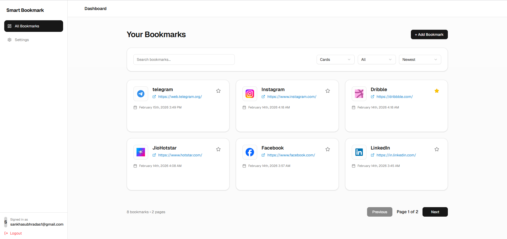
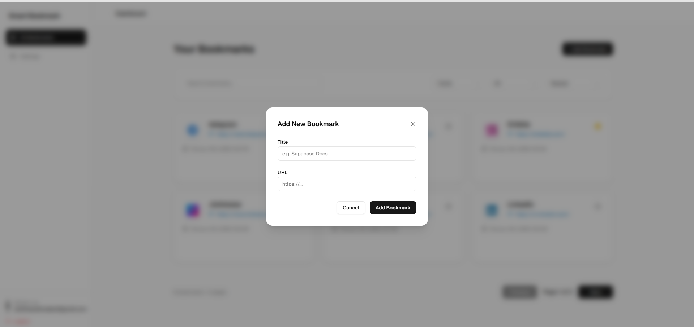
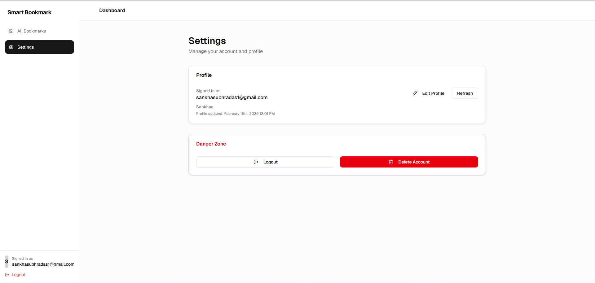
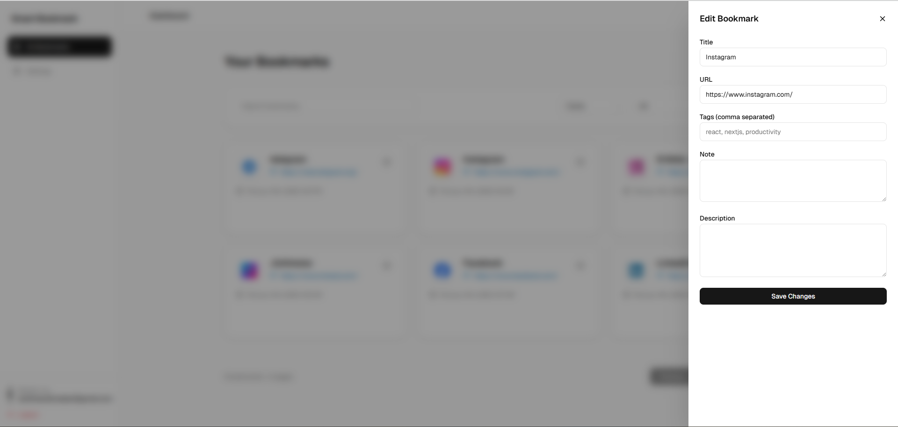

# 🚀 Smart Bookmark – Client Application

## 📑 Table of Contents

- Overview
- Tech Stack
- Project Structure
- Authentication
- Core Features
  - Bookmark Management
  - Real-Time Sync
  - Dashboard Analytics
  - Fully Responsive
- Security
- Gallery
- Getting Started
- Production Build
- Deployment
- Future Enhancements
- Developer
- License
- Philosophy

---

Smart Bookmark is a modern, secure, SaaS-grade bookmark management platform built with **Next.js App Router**, **Supabase**, and **TypeScript**.

This repository contains the **Client Portal**, where end users can securely manage bookmarks, track analytics, and interact with their account in real-time.

---

## 🌟 Overview

Smart Bookmark allows users to:

- 🔖 Save and organize bookmarks
- 📊 View analytics insights
- 🔄 Experience real-time sync
- 🔐 Login via Google OAuth
- 📱 Use a fully responsive SaaS dashboard
- 🎨 Enjoy a premium, modern UI/UX

This application is designed with **production-level architecture**, security best practices, and scalable folder structuring.

---

## 🏗️ Tech Stack

| Category        | Technology |
|-----------------|------------|
| Framework       | Next.js 16 (App Router) |
| Language        | TypeScript |
| Styling         | Tailwind CSS |
| UI Components   | ShadCN UI |
| Animations      | Framer Motion |
| Icons           | Lucide React |
| Backend         | Supabase (Postgres + Auth + Realtime) |
| Notifications   | Sonner |
| Deployment      | Vercel |

---

## 📁 Project Structure

```
client-app/
│
├── __mocks__/
│
├── supabase.ts
│
├── .next/
├── dev/
├── .swc/
│   └── plugins/
│       └── win32_x64_23.0.0/
│
├── node_modules/
│
├── public/
│   ├── file.svg
│   ├── globe.svg
│   ├── next.svg
│   ├── vercel.svg
│   └── window.svg
│
├── src/
│   │
│   ├── app/
│   │   │
│   │   ├── (protected)/
│   │   │   └── dashboard/
│   │   │       ├── __tests__/
│   │   │       │   └── dashboard.test.tsx
│   │   │       │
│   │   │       ├── settings/
│   │   │       │   ├── page.tsx
│   │   │       │   ├── layout.tsx
│   │   │       │   └── loading.tsx
│   │   │       │
│   │   │       └── page.tsx
│   │   │
│   │   ├── (public)/
│   │   │   └── footer/
│   │   │       ├── about/
│   │   │       │   └── page.tsx
│   │   │       │
│   │   │       ├── blog/
│   │   │       │   └── [slug]/
│   │   │       │       └── page.tsx
│   │   │       │
│   │   │       ├── contact/
│   │   │       │   └── page.tsx
│   │   │       │
│   │   │       ├── cookies/
│   │   │       │   └── page.tsx
│   │   │       │
│   │   │       ├── faq/
│   │   │       │   └── page.tsx
│   │   │       │
│   │   │       ├── privacy-policy/
│   │   │       │   └── page.tsx
│   │   │       │
│   │   │       ├── security/
│   │   │       │   └── page.tsx
│   │   │       │
│   │   │       └── terms-of-service/
│   │   │           └── page.tsx
│   │   │
│   │   ├── login/
│   │   │   └── page.tsx
│   │   │
│   │   ├── api/
│   │   │   ├── contact/
│   │   │   │   └── route.ts
│   │   │   │
│   │   │   ├── delete-account/
│   │   │   │   └── route.ts
│   │   │   │
│   │   │   ├── geo/
│   │   │   │   ├── countries/
│   │   │   │   │   └── route.ts
│   │   │   │   │
│   │   │   │   └── states/
│   │   │   │       └── route.ts
│   │   │   │
│   │   │   ├── logout/
│   │   │   │   └── route.ts
│   │   │   │
│   │   │   └── auth/
│   │   │       └── callback/
│   │   │           └── route.ts
│   │   │
│   │   ├── auth/
│   │   │   └── callback/
│   │   │       └── route.ts
│   │   │
│   │   ├── favicon.ico
│   │   ├── globals.css
│   │   ├── layout.tsx
│   │   └── page.tsx
│   │
│   ├── components/
│   │   │
│   │   ├── auth/
│   │   │   ├── GoogleLoginButton.tsx
│   │   │   └── LogoutButton.tsx
│   │   │
│   │   ├── layout/
│   │   │   ├── Navbar.tsx
│   │   │   └── UserMenu.tsx
│   │   │
│   │   ├── settings/
│   │   │   ├── ConfirmDialog.tsx
│   │   │   └── ProfileModal.tsx
│   │   │
│   │   ├── shared/
│   │   │   ├── ErrorMessage.tsx
│   │   │   ├── Loader.tsx
│   │   │   └── PageWrapper.tsx
│   │   │
│   │   └── ui/
│   │       ├── badge.tsx
│   │       ├── button.tsx
│   │       ├── card.tsx
│   │       ├── dialog.tsx
│   │       ├── dropdown-menu.tsx
│   │       ├── input.tsx
│   │       ├── label.tsx
│   │       ├── select.tsx
│   │       ├── separator.tsx
│   │       ├── switch.tsx
│   │       └── textarea.tsx
│   │
│   ├── data/
│   │   └── blogPosts.ts
│   │
│   ├── lib/
│   │   ├── config/
│   │   ├── supabase/
│   │   ├── constants.ts
│   │   └── utils.ts
│   │
│   ├── modules/
│   │   ├── auth/
│   │   │   ├── components/
│   │   │   │   ├── GoogleLoginButton.tsx
│   │   │   │   └── LogoutButton.tsx
│   │   │   │
│   │   │   ├── hooks/
│   │   │   │   ├── useBookmarks.ts
│   │   │   │   ├── useRealtimeBookmarks.ts
│   │   │   │   └── useUsers.ts
│   │   │   │
│   │   │   ├── services/
│   │   │   │   └── auth.service.ts
│   │   │   │
│   │   │   └── types.ts
│   │   │
│   │   ├── dashboard/
│   │   │   └── components/
│   │   │       ├── __tests__/
│   │   │       │   ├── BookmarkCard.test.tsx
│   │   │       │   └── DeleteBookmarkModal.test.tsx
│   │   │       │
│   │   │       ├── AddBookmarkModal.tsx
│   │   │       ├── BookmarkCard.tsx
│   │   │       ├── BookmarkHeadlineView.tsx
│   │   │       ├── BookmarkListView.tsx
│   │   │       ├── BookmarkMoodboardView.tsx
│   │   │       ├── ConfirmDialogModal.tsx
│   │   │       ├── DashboardFilters.tsx
│   │   │       ├── DeleteBookmarkModal.tsx
│   │   │       ├── EditBookmarkDrawer.tsx
│   │   │       ├── Sidebar.tsx
│   │   │       └── Topbar.tsx
│   │   │
│   │   ├── landing/
│   │   │   ├── components/
│   │   │   │   ├── AccessSection.tsx
│   │   │   │   ├── CTASection.tsx
│   │   │   │   ├── Footer.tsx
│   │   │   │   ├── HeroSection.tsx
│   │   │   │   ├── LandingNavbar.tsx
│   │   │   │   ├── PricingSection.tsx
│   │   │   │   └── SecuritySection.tsx
│   │   │   │
│   │   │   ├── animations.ts
│   │   │   └── index.ts
│   │   │
│   │   └── shared/
│   │       ├── components/
│   │       │   ├── Container.tsx
│   │       │   ├── ErrorMessage.tsx
│   │       │   ├── Loader.tsx
│   │       │   ├── MarketingPageWrapper.tsx
│   │       │   └── PageWrapper.tsx
│   │       │
│   │       ├── hooks/
│   │       ├── utils/
│   │       └── helpers.ts
│   │
│   ├── types/
│   │   └── bookmarks.ts
│   │
│   ├── database.ts
│   ├── index.ts
│   └── middleware.ts
│
├── .env.local
├── .gitignore
├── components.json
├── eslint.config.mjs
├── jest.config.ts
├── jest.setup.ts
├── next-env.d.ts
├── next.config.ts
├── package-lock.json
├── package.json
├── postcss.config.mjs
├── README.md
└── tsconfig.json

```

Architecture follows modular SaaS patterns for maintainability and scalability.

---

## 🔐 Authentication

Authentication is handled using **Supabase Auth** with:

- Google OAuth
- Session management
- Secure cookies
- Row Level Security (RLS) enforced at database level

---

## 🧠 Core Features

### 📌 Bookmark Management
- Create, edit, delete bookmarks
- Categorize and tag
- Multiple display views (Card, List, Moodboard, Headline)

### ⚡ Real-Time Sync
Bookmarks update across multiple tabs and sessions instantly.

### 📊 Dashboard Analytics
- Bookmark count
- Usage tracking
- Performance visualization

### 📱 Fully Responsive
Mobile-first design optimized for:
- Desktop
- Tablet
- Mobile devices

---

## 🛡️ Security

Smart Bookmark implements:

- Supabase Row Level Security (RLS)
- Protected routes using App Router patterns
- Server-side validation
- Secure environment variables
- API route isolation

---

## 🖼️ Gallery

Add screenshots inside a `/public/screenshots` folder and reference them like below.

### 🔐 Login Page


### 📊 Dashboard Overview


### 🔖 Bookmark Management


### 📱 Responsive View


### Edit Form View


---

You can also use centered HTML formatting if preferred:

```html

  

```

---

## 🖥️ Getting Started

### 1️⃣ Clone Repository

```bash
git clone https://github.com/your-username/Bookmark-fullstack-app.git
cd Bookmark-fullstack-app/client-app
```

### 2️⃣ Install Dependencies

```bash
npm install
```

### 3️⃣ Setup Environment Variables

Create a `.env.local` file:

```env
NEXT_PUBLIC_SUPABASE_URL=
NEXT_PUBLIC_SUPABASE_ANON_KEY=
SUPABASE_URL=
SERVICE_KEY=
SUPABASE_SERVICE_ROLE_KEY=
```

### 4️⃣ Run Development Server

```bash
npm run dev
```

App will run on: `http://localhost:3000`

---

## 🚀 Production Build

```bash
npm run build
npm start
```

---

## 🌍 Deployment

The application is optimized for **Vercel** deployment.

Ensure environment variables are configured in Vercel dashboard before deploying.

---

## 🧩 Future Enhancements

- 📈 Advanced analytics dashboard
- 🗂️ Folder-based bookmark organization
- 🤝 Sharing & collaboration
- 🔎 AI-powered smart tagging
- 📊 Usage trend analysis

---

## 🧑‍💻 Developer

Built with precision and modern SaaS architecture by:

**Sankha Subhra Das**  
Full Stack Developer  
Next.js • Supabase • TypeScript • SaaS Architecture

**Portfolio:** https://www.sankhasubhradasportfolio.in/

---

## 📜 License

This project is licensed for educational and portfolio demonstration purposes.

---

## 💡 Philosophy

Smart Bookmark is built with:

- Clean architecture
- Strong security principles
- Scalable design patterns
- Premium UI/UX standards
- Production-ready structure

**This is not a demo app — it is built like a real SaaS product.**

---
